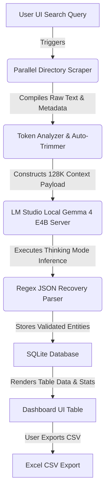

# 🎯 NilLeads — AI-Powered Client Finder

[](LICENSE)
[](requirements.txt)
[](https://lmstudio.ai)
[](https://lmstudio.ai)

**NilLeads** is a high-performance, 100% local AI-powered lead scraping, evaluation, and prospect scoring pipeline designed for freelancers and developers. It exploits the **128K context window** of the local **Gemma 4 E4B Mixture-of-Experts (MoE)** model hosted in LM Studio to batch crawl directories, scrape target websites in parallel, and analyze all prospects in a single, high-context model completion call without chunking or external API costs.

---

## 👨‍💻 Credits & System Architecture Roles

This system was designed, co-engineered, and optimized by **[Nil Patel](https://nilpatel.snpsolutions.co.nz)** (Lead Systems Architect & Core Developer).

*   **Scraper Engine & Prompt Design**: Nil Patel
*   **Local Inference Pipeline (LM Studio/Gemma)**: Nil Patel
*   **Database Schema & UI Design**: Nil Patel

For collaboration, support, or production setups, contact **Nil Patel** via:
*   🌐 **Portfolio**: [nilpatel.snpsolutions.co.nz](https://nilpatel.snpsolutions.co.nz)
*   🐙 **GitHub**: [github.com/nilpatel7530](https://github.com/nilpatel7530)
*   ✉️ **Email**: [nilpatel7530@gmail.com](mailto:nilpatel7530@gmail.com)

---

## 🏗️ System Architecture & Workflow Pipeline

NilLeads runs parallel Beautiful Soup 4 scrappers to compile web directory cache datasets and passes them through a token-optimized pipeline to local GPU inference instances.



### Component Structure

| Script File | Core Functional Responsibility |
|:---|:---|
| [`app.py`](./app.py) | Coordinates the Flask web application server, processes search streams (SSE), and serves lead management API endpoints. |
| [`scraper.py`](./scraper.py) | Manages web directory crawlers (e.g. Google cache / directories), extracts text, evaluates content token sizes, and manages trimmers. |
| [`ai_extractor.py`](./ai_extractor.py) | Interfaces with LM Studio local completions API, overrides temperature configurations, manages thinking toggles, and parses JSON blocks. |
| [`database.py`](./database.py) | Wraps SQLite connection pools, manages the database schema initialization, and computes fit-score averages. |

---

## ⚙️ LM Studio & Gemma 4 E4B Configuration

To support 128K context batch extraction and prevent out-of-memory (OOM) GPU crashes, configure LM Studio exactly as follows:

1.  **Model Selection**:
    *   Open LM Studio and search for **Gemma 4 E4B** (or similar Mixture-of-Experts GGUF model).
    *   Download and load the model (Recommended: `Q4_K_M` or `Q5_K_M` quantizations).

2.  **Hardware & Model Settings** (Right Sidebar):
    *   Set **Context Length** manually to **`131072`** (representing 128K tokens).
    *   Toggle **Flash Attention** to **ON** (critical for memory safety and speeding up processing times at 100K+ token counts).
    *   Adjust GPU Offload to match your system's VRAM limits.

3.  **Local API Server**:
    *   Open the Local Server tab (double-arrow icon in the left sidebar).
    *   Set the server port to **`1234`**.
    *   Click **Start Server** (Server URL: `http://localhost:1234/v1`).

---

## 🚀 Installation & Operating Guide

### Prerequisites
*   Python 3.9+ ([Download](https://www.python.org/downloads/))
*   LM Studio running with Gemma 4 E4B loaded.

### Setup Instructions

1.  **Clone and Navigate to Project Directory**:
    ```bash
    cd C:\projects\leadscraper
    ```

2.  **Install Requirements**:
    ```bash
    pip install -r requirements.txt
    ```

3.  **Launch the Scraper Application**:
    ```bash
    python app.py
    ```

4.  **Access the Dashboard**:
    *   Open your web browser and navigate to: `http://localhost:5000`

---

## 💾 SQLite Database Schema

State and data persistence is maintained in [`leads.db`](./leads.db) managed via [`database.py`](./database.py):

```sql
CREATE TABLE leads (
  id             INTEGER PRIMARY KEY AUTOINCREMENT,
  name           TEXT,
  business       TEXT,
  email          TEXT,
  phone          TEXT,
  website        TEXT,
  address        TEXT,
  niche          TEXT,
  fit_score      INTEGER,
  reason         TEXT,
  has_website    INTEGER DEFAULT 0,
  outreach_tip   TEXT,
  source_url     TEXT,
  scraped_at     TIMESTAMP DEFAULT CURRENT_TIMESTAMP,
  contacted      INTEGER DEFAULT 0,
  notes          TEXT
);
```

---

## 🛡️ Error Tolerance & Robustness Design

*   **Offline Synthesizer Fallback**: If the local LM Studio server goes offline, the UI status indicator glows red and the application triggers a local static keyword-matching synthesizer fallback, generating mock target leads so user workflows aren't blocked.
*   **Malformed JSON Recovery**: Local models can output headers, explanations, or truncated brackets. `ai_extractor.py` employs a regex parser to isolate and rebuild incomplete JSON blocks `{...}` before inserting them into SQLite.
*   **Context Auto-Trimmer**: Protects the local server from crashing under high context loads. If the concatenated HTML scrapes exceed `120,000` tokens, the scraper auto-trims non-semantic tags and truncates the string to 480,000 characters.

---

## 📄 License

This project is licensed under the MIT License - see the [LICENSE](LICENSE) file for details.

Co-engineered with ❤️ by **[Nil Patel](https://nilpatel.snpsolutions.co.nz)**. If this project helps you find clients, drop a star! ⭐


---
*Made with Antigravity*
